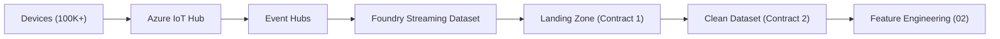

# 01 — Ingestion

How IoT sensor data flows from 100K+ refrigeration devices into Foundry and gets cleaned for downstream consumption. This section covers the path from device to landing zone to clean dataset — everything before feature engineering begins.

## What's Here

| Document | Answers |
|----------|---------|
| [architecture.md](./architecture.md) | How does sensor data get from a device to Foundry? What are the latency targets? What fails and how do we detect it? |
| [streaming-vs-batch.md](./streaming-vs-batch.md) | Why do we stream data in but process it in batch? When does streaming processing make sense? |
| [schema-management.md](./schema-management.md) | How do we handle schema changes — new sensors, removed sensors, firmware differences — without breaking downstream pipelines? |

## How This Section Fits

The ingestion pipeline is the leftmost boundary of the system. It is governed by two data contracts defined in [data-contracts.md](../05-architecture/data-contracts.md):

- **Contract 1 (Raw → Landing Zone)**: append-only, no transformation, system of record
- **Contract 2 (Landing Zone → Clean)**: deduplicated, range-validated, timezone-normalized

Everything downstream — feature engineering, model scoring, alerting — depends on the guarantees established here. If ingestion breaks, the entire pipeline breaks.

## Key Numbers

| Metric | Value |
|--------|-------|
| Devices | 100K+ |
| Sensors per device | 14 |
| Reading frequency | ~1/min per sensor |
| Fleet throughput | ~14M readings/min |
| Landing zone freshness SLA | ≤ 2 min from IoT Hub receipt |
| Clean dataset freshness SLA | ≤ 15 min from landing zone append |

## Related Sections

- [Palantir — Streaming Ingestion](../04-palantir/streaming-ingestion.md) — Foundry streaming dataset configuration and materialization patterns
- [Palantir — Transform Patterns](../04-palantir/transform-patterns.md) — how the cleansing transform is implemented
- [Architecture — Data Contracts](../05-architecture/data-contracts.md) — schema definitions and SLAs
- [Architecture — ADR-002](../05-architecture/adr-002-batch-plus-streaming.md) — why we use a hybrid batch + streaming approach
