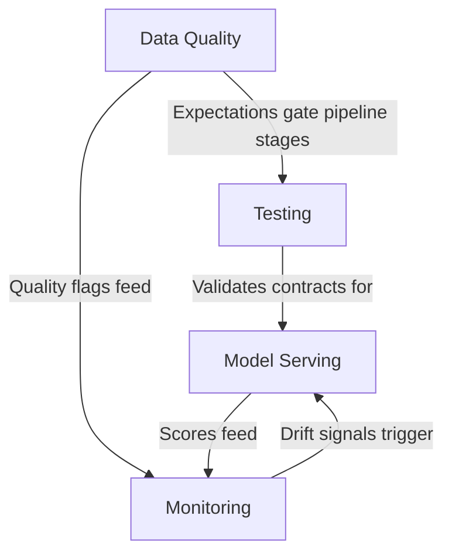
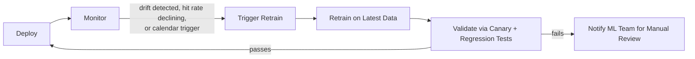

# Production Operations

Running ML models reliably at scale is harder than training them. This section covers everything needed to keep anomaly detection working across 100K+ refrigeration devices — data quality enforcement, testing strategies, model serving, and monitoring.

## What's Here

| Document | Purpose |
|---|---|
| [Data Quality](./data-quality.md) | Enforcing data contracts at every pipeline boundary using Foundry dataset expectations. Sensor dropout detection, range validation, freshness monitoring, and the `quality_flags` system. |
| [Testing](./testing.md) | Testing Foundry Transforms, generating synthetic refrigeration sensor data, schema validation against data contracts, and CI/CD patterns for Code Repositories. |
| [Model Serving](./model-serving.md) | How models score in production — batch scoring Transforms, streaming threshold rules, multi-model parallel scoring, canary deployments, and the score-to-alert pipeline. |
| [Monitoring](./monitoring.md) | Three-layer monitoring (infrastructure, data, model), drift detection, retraining triggers, dashboards for different audiences, and incident response runbooks. |

## How These Docs Relate

Data quality enforcement happens first — if bad data enters the pipeline, nothing downstream matters. Testing validates that each pipeline stage honors its [data contract](../05-architecture/data-contracts.md). Model serving produces scores and alerts. Monitoring watches everything and closes the feedback loop.

## Design Principles

| Principle | How It Is Achieved |
|---|---|
| **Reliability** | Dataset expectations gate every pipeline boundary — bad data is never silently propagated. Rules-based fallback ensures alerting continues even when ML models are unavailable. Streaming threshold rules provide independent coverage for acute failures. |
| **Scalability** | Batch scoring handles 100K+ devices per run via Foundry-managed Spark. Streaming path uses Flink for sub-minute latency on acute anomalies. Per-model scoring Transforms run independently and scale horizontally. |
| **Maintainability** | Each model has its own scoring Transform and Code Repository. Data contracts define explicit boundaries between pipeline stages. Monitoring Transforms are separate from scoring Transforms — changes to monitoring don't risk scoring regressions. |
| **Adaptability** | Automated retraining triggers detect when models degrade. Canary deployments validate new model versions before full rollout. Per-device and per-cohort thresholds in the Ontology enable calibration without code changes. |

## System SLA Summary

| SLA | Target | Measurement Method |
|---|---|---|
| End-to-end latency (batch) | < 2 hours from sensor reading to alert | `alert_created_at` − `timestamp_utc` of contributing readings |
| End-to-end latency (streaming) | < 2 minutes from sensor reading to CRITICAL alert | Streaming pipeline end-to-end watermark lag |
| Scoring availability | 99.5% of scheduled scoring runs complete successfully | Successful builds / scheduled builds over 30-day rolling window |
| Device coverage | ≥ 99% of active devices scored per batch run | Scored devices / active devices in device registry |
| False positive rate | < 20% of HIGH/CRITICAL alerts marked as false positive by operators | `device_alerts` where `status = false_positive` / total HIGH+CRITICAL alerts over 30-day window |

## Continual Learning Loop

The system follows a closed-loop lifecycle. Models are not deployed once and left to age — they are continuously monitored and retrained as the fleet and environment evolve:

1. **Deploy**: new model version promoted to production via [canary deployment](./model-serving.md#canary-deployments)
2. **Monitor**: [three-layer monitoring](./monitoring.md) watches infrastructure, data, and model health continuously
3. **Trigger**: [automated retraining triggers](./monitoring.md#retraining-triggers) fire when drift, agreement decline, or calendar thresholds are exceeded
4. **Retrain**: retraining pipeline runs on latest feature data with current fleet composition
5. **Validate**: retrained model must pass canary evaluation criteria and [regression tests](./testing.md#regression-testing) against a fixed test dataset
6. **Deploy or Escalate**: if validation passes, the model is promoted automatically. If it fails, the ML team reviews manually.

## Upstream Dependencies

- [Data Contracts](../05-architecture/data-contracts.md) — the schemas and SLAs these docs enforce and monitor
- [Feature Engineering](../02-feature-engineering/) — the feature computation logic being tested and monitored
- [Transform Patterns](../04-palantir/transform-patterns.md) — how Transforms are structured (test harness patterns depend on this)
- [Ontology Design](../04-palantir/ontology-design.md) — how scores and alerts surface to operators
- [Model Integration](../04-palantir/model-integration.md) — model training, adapters, and evaluation strategies
- [ADR-002: Batch + Streaming](../05-architecture/adr-002-batch-plus-streaming.md) — why we have two scoring paths
