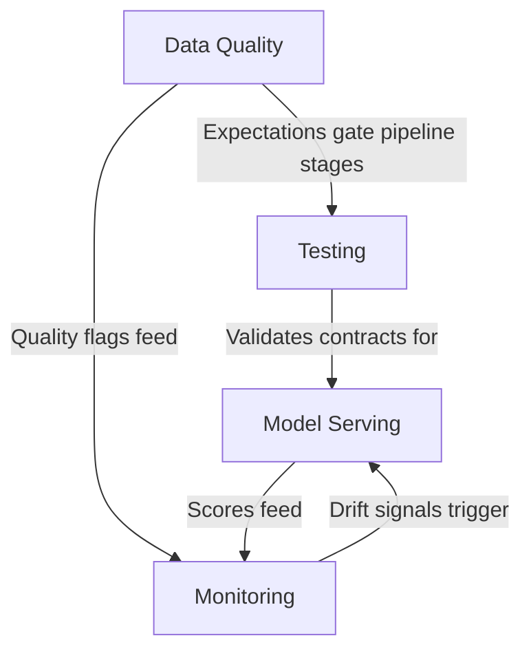

# Production Operations

Running ML models reliably at scale is harder than training them. This section covers everything needed to keep anomaly detection working across 100K+ refrigeration devices — data quality enforcement, testing strategies, model serving, and monitoring.

## What's Here

| Document | Purpose |
|---|---|
| [Data Quality](./data-quality.md) | Enforcing data contracts at every pipeline boundary using Foundry dataset expectations. Sensor dropout detection, range validation, freshness monitoring, and the `quality_flags` system. |
| [Testing](./testing.md) | Testing Foundry Transforms, generating synthetic refrigeration sensor data, schema validation against data contracts, and CI/CD patterns for Code Repositories. |
| [Model Serving](./model-serving.md) | How models score in production — batch scoring Transforms, streaming threshold rules, multi-model parallel scoring, canary deployments, and the score-to-alert pipeline. |
| [Monitoring](./monitoring.md) | Three-layer monitoring (infrastructure, data, model), drift detection, retraining triggers, dashboards for different audiences, and incident response runbooks. |

## How These Docs Relate

Data quality enforcement happens first — if bad data enters the pipeline, nothing downstream matters. Testing validates that each pipeline stage honors its [data contract](../05-architecture/data-contracts.md). Model serving produces scores and alerts. Monitoring watches everything and closes the feedback loop.

## Upstream Dependencies

- [Data Contracts](../05-architecture/data-contracts.md) — the schemas and SLAs these docs enforce and monitor
- [Feature Engineering](../02-feature-engineering/) — the feature computation logic being tested and monitored
- [Transform Patterns](../04-palantir/transform-patterns.md) — how Transforms are structured (test harness patterns depend on this)
- [Ontology Design](../04-palantir/ontology-design.md) — how scores and alerts surface to operators
- [Model Integration](../04-palantir/model-integration.md) — model training, adapters, and evaluation strategies
- [ADR-002: Batch + Streaming](../05-architecture/adr-002-batch-plus-streaming.md) — why we have two scoring paths
