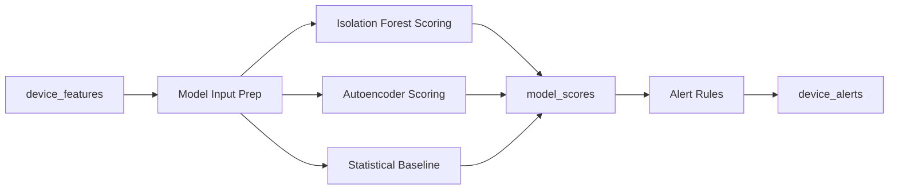
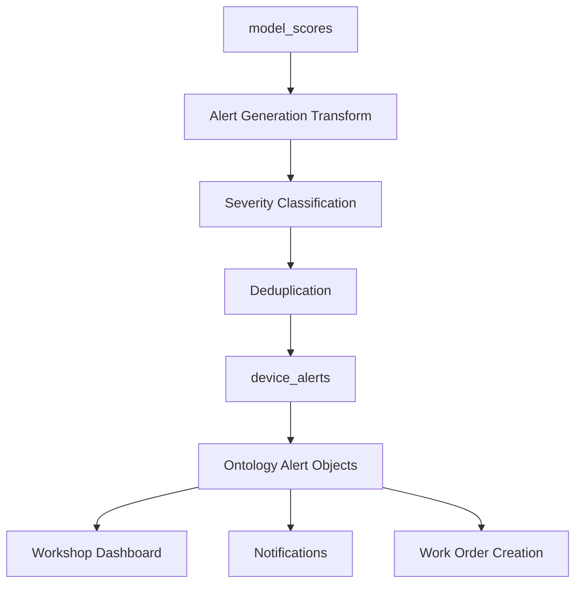

# Model Serving in Production

## Why Model Serving Is Not Just "Run the Model"

Training a model is the easy part. Serving it reliably across 100K devices means handling model versioning, multi-model scoring, fallback when things break, and a clear pipeline from raw scores to actionable alerts. A model that scores correctly in a notebook but can't be deployed, versioned, or rolled back is not production-ready.

This doc covers the two scoring paths ([batch and streaming](../05-architecture/adr-002-batch-plus-streaming.md)), multi-model parallel scoring, versioning and canary deployments, fallback behavior, and how scores become alerts.

## Batch Scoring Pipeline

The batch path is the primary scoring mechanism. It runs as a Foundry Transform that loads a published model artifact and applies it to the latest feature dataset.

### Architecture



### Scoring Transform

Each model has its own scoring Transform. The Transform loads the model via Foundry's `ModelInput`, scores the feature dataset, and writes to `model_scores` (see [Contract 5](../05-architecture/data-contracts.md#contract-5-model-output--scored-dataset)).

```python
from transforms.api import transform, Input, Output
from palantir_models.transforms import ModelInput
from datetime import datetime

@transform(
    output=Output("/Company/pipelines/refrigeration/scores/isolation_forest_scores"),
    features=Input("/Company/pipelines/refrigeration/features/device_features"),
    model=ModelInput("/Company/models/refrigeration/isolation_forest"),
)
def score_isolation_forest(features, model, output):
    features_df = features.dataframe()

    # Filter to latest window — don't re-score historical windows
    latest_window = features_df.agg(F.max("window_end")).collect()[0][0]
    current_features = features_df.filter(F.col("window_end") == latest_window)

    # Exclude devices with insufficient sensor data
    scorable = current_features.filter(F.col("sensor_completeness") >= 0.5)

    # Score via model adapter (runs in Pandas — see Model Integration)
    scores_pd = model.transform({"features_df": scorable.toPandas()})["scores_df"]

    # Add metadata required by Contract 5
    scores_pd["model_id"] = "isolation_forest"
    scores_pd["model_version"] = model.version
    scores_pd["granularity"] = "fleet"
    scores_pd["scored_at"] = datetime.utcnow()

    output.write_dataframe(
        spark.createDataFrame(scores_pd),
        partition_cols=["scored_at_date"],
    )
```

See [Model Integration](../04-palantir/model-integration.md#batch-scoring-via-transforms) for the full model adapter pattern and `ModelInput`/`ModelOutput` details.

### Scoring Schedule

| Scoring Type | Schedule | Models Run | Use Case |
|---|---|---|---|
| Hourly batch | Every hour | Isolation Forest, Statistical Baseline | Routine fleet monitoring — populates [Device.latest_anomaly_score](../04-palantir/ontology-design.md#device) |
| Daily batch | 03:00 UTC daily | All models (IF, Autoencoder, Statistical, DBSCAN cohort) | Full fleet analysis, model comparison dashboards |
| On-demand | Manual trigger | Any single model | Re-score after maintenance, investigate specific devices |

**SLA**: batch scores available within **1 hour** of feature store update ([Contract 5 SLA](../05-architecture/data-contracts.md#contract-5-model-output--scored-dataset)).

## Streaming Scoring

The streaming path catches acute anomalies that can't wait for the next batch run. It does **not** run complex ML models — it applies lightweight threshold-based rules that detect dangerous conditions in near-real-time.

### What Streaming Scoring Is (and Isn't)

| | Batch Scoring | Streaming Scoring |
|---|---|---|
| Input | Pre-aggregated features (15-min windows) | Raw or minimally aggregated sensor readings |
| Model complexity | Full ML models (Isolation Forest, Autoencoder) | Threshold rules only |
| Detection target | Gradual degradation (hours to days) | Acute failures (seconds to minutes) |
| Latency | ~1 hour end-to-end | < 2 minutes end-to-end |
| Alert severity | LOW through HIGH | CRITICAL only |
| Implementation | Foundry batch Transform + model adapter | Foundry streaming Transform (Flink-based) |

### Streaming Rules

These rules fire when individual sensor readings cross absolute or relative thresholds. Thresholds are stored as [Device object](../04-palantir/ontology-design.md#device) properties in the Ontology, enabling per-device or per-cohort calibration.

| Rule | Condition | Failure Mode |
|---|---|---|
| Compressor overload | `current_compressor` > device-specific absolute threshold (default: 40A) | Immediate mechanical damage risk |
| Vibration spike | `vibration_compressor` > 3× device's 24h moving average | Sudden bearing failure or foreign object |
| Acute pressure loss | `pressure_low_side` drops > 30% within 5-minute window | Rapid refrigerant leak |
| Total cooling loss | `temperature_evaporator` rising > 2°C/min sustained for 3 minutes | Complete compressor failure or power loss |

### Streaming Transform

```python
# Flink-based streaming Transform (simplified)
# Runs continuously on the streaming sensor dataset

@streaming_transform(
    output=Output("/Company/pipelines/refrigeration/alerts/streaming_critical"),
    readings=Input("/Company/pipelines/refrigeration/raw/sensor_readings"),
)
def detect_acute_anomalies(readings):
    # Read device-specific thresholds from Ontology (pre-hydrated)
    device_thresholds = load_device_thresholds()

    return (
        readings
        .join(device_thresholds, "device_id")
        .filter(
            (F.col("current_compressor") > F.col("current_threshold")) |
            (F.col("vibration_compressor") > F.col("vibration_threshold") * 3)
        )
        .select(
            F.expr("uuid()").alias("alert_id"),
            "device_id",
            F.lit("ANOMALY_DETECTED").alias("alert_type"),
            F.lit("CRITICAL").alias("severity"),
            # ... remaining Contract 6 columns
        )
    )
```

### How Batch and Streaming Interact

When the streaming path fires a CRITICAL alert, the next batch scoring run either confirms or softens it:

- **Confirmed**: batch score is also high (> 0.85) → alert type changes to `ANOMALY_SUSTAINED`. The anomaly is real and ongoing.
- **Softened**: batch score is low (< 0.6) → alert type changes to `ANOMALY_RESOLVED` with a note that the event was transient. This prevents the streaming path from being a persistent source of false positives.

Streaming thresholds are derived from batch model training — the batch models' learned decision boundaries inform the absolute thresholds. When models are retrained, streaming thresholds should be reviewed and updated. See [ADR-002](../05-architecture/adr-002-batch-plus-streaming.md#how-they-interact) for the full interaction design.

## Multi-Model Parallel Scoring

We run multiple unsupervised anomaly detection models and compare their outputs. This isn't ensemble averaging — each model writes its own scores to the same `model_scores` dataset, and downstream alert logic uses model agreement as a severity signal.

### Models in Production

| Model | `model_id` | Granularity | Scoring Frequency | Strengths |
|---|---|---|---|---|
| Isolation Forest | `isolation_forest_v{N}` | fleet | Hourly | Fast, handles high-dimensional data, interpretable feature importances |
| Autoencoder | `autoencoder_v{N}` | cohort | Daily | Captures nonlinear relationships, reconstruction error is intuitive |
| Statistical Baseline | `statistical_baseline_v{N}` | fleet | Hourly | Per-device z-scores; catches device-specific drift that fleet models miss |
| DBSCAN Cohort | `dbscan_cohort_v{N}` | cohort | Daily | Segments fleet into behavioral groups; detects devices drifting out of their cohort |

### Parallel Scoring Architecture

Each model has its own scoring Transform in its own Code Repository. All Transforms read from the same `device_features` dataset and write to the same `model_scores` dataset (different `model_id` values, so no row conflicts).

```
device_features
    ├── isolation_forest_scoring_transform → model_scores (model_id = "isolation_forest_v2")
    ├── autoencoder_scoring_transform      → model_scores (model_id = "autoencoder_v1")
    ├── statistical_baseline_transform     → model_scores (model_id = "statistical_baseline_v3")
    └── dbscan_cohort_transform            → model_scores (model_id = "dbscan_cohort_v1")
```

Foundry handles concurrent writes to the same output dataset via transactions — each Transform commits its own transaction independently.

### Model Agreement for Severity

The [alert severity rules](../05-architecture/data-contracts.md#severity-rules) use model agreement:

- **1 model flags anomaly** → considered LOW severity (single model may be noisy)
- **2+ models agree** → bumped to MEDIUM at minimum
- **All models agree with high scores** → HIGH or CRITICAL

This is implemented in the alert generation Transform, which reads all `model_scores` rows for the same `device_id` and `window_end`, groups by device, and counts how many distinct `model_id` values have `anomaly_flag = true`.

## Model Versioning

### How Versioning Works in Foundry

Each model publish creates a new version in the Foundry model store (see [Model Integration — Publishing](../04-palantir/model-integration.md#model-publishing-and-versioning)). The scoring Transform references the model by path, and Foundry resolves to the latest released version by default.

```python
# This always uses the latest released version
model=ModelInput("/Company/models/refrigeration/isolation_forest")

# To pin to a specific version (for stability or rollback)
model=ModelInput("/Company/models/refrigeration/isolation_forest", version="v2.3.1")
```

### Deploying a New Version Without Downtime

1. **Train and publish** the new model version on a feature branch. The model artifact is in draft status — scoring Transforms ignore it.
2. **Promote to staging** by merging the training branch. The model is now in the staging model store.
3. **Run canary deployment** (see below) to validate the new version on a subset.
4. **Promote to release** — the model becomes the latest released version. The scoring Transform automatically picks it up on its next scheduled run.
5. **Monitor** the first few scoring runs closely (see [Monitoring](./monitoring.md#layer-3-model-monitoring)). If the score distribution shifts unexpectedly, roll back by pinning the scoring Transform to the previous version.

There is no downtime because the scoring Transform runs on a schedule. The old version produces scores until the next run, which picks up the new version. The transition happens between runs, not during one.

### Rollback

To roll back a model version:

1. Update the scoring Transform to pin a specific version: `ModelInput("...", version="v2.2.0")`
2. Rebuild the scoring Transform
3. The next scoring run uses the old version

This is a code change in Code Repositories, which goes through the normal branch → staging → release flow. For emergency rollbacks, merge directly to release with appropriate review.

## Canary Deployments

Before promoting a new model version to full production, score it on a subset and compare to the existing model.

### Canary Pattern

```python
@transform(
    output=Output("/Company/pipelines/refrigeration/scores/canary_scores"),
    features=Input("/Company/pipelines/refrigeration/features/device_features"),
    canary_model=ModelInput("/Company/models/refrigeration/isolation_forest", version="v3.0.0"),
    production_model=ModelInput("/Company/models/refrigeration/isolation_forest", version="v2.3.1"),
)
def canary_scoring(features, canary_model, production_model, output):
    features_df = features.dataframe().toPandas()

    # Score with both models
    canary_scores = canary_model.transform({"features_df": features_df})["scores_df"]
    prod_scores = production_model.transform({"features_df": features_df})["scores_df"]

    # Compare
    comparison = canary_scores.merge(prod_scores, on="device_id", suffixes=("_canary", "_prod"))
    comparison["score_diff"] = comparison["anomaly_score_canary"] - comparison["anomaly_score_prod"]

    output.write_dataframe(spark.createDataFrame(comparison))
```

### Canary Evaluation Criteria

| Metric | Threshold | Action If Exceeded |
|---|---|---|
| Mean absolute score difference | < 0.05 | Investigate — model learned something meaningfully different |
| Contamination rate change | ±2% | Block promotion — too many/few devices flagged |
| Top-100 device overlap | ≥ 80% | Review — new model flagging different devices |
| Score distribution KL divergence | < 0.1 | Block promotion — distributions diverged |

The canary Transform output goes to a dashboard, not to the production alert pipeline. Canary scores never generate real alerts.

## Fallback Behavior

Models fail. Scoring Transforms can crash (OOM, dependency error, bad model artifact), produce wrong results (schema mismatch, NaN scores), or simply not run (scheduling delay, upstream data stale). The system must degrade gracefully.

### Failure Modes and Responses

| Failure Mode | Detection | Fallback Response |
|---|---|---|
| Scoring Transform crashes | Transform build fails → Foundry pipeline alert | Use last successful scores. After 2 hours stale, switch to rules-based fallback. |
| Model produces NaN/null scores | Dataset expectation on `anomaly_score` not null | Transform build fails — no bad scores written. Uses last good scores. |
| Score distribution anomalous | Monitoring detects KL divergence > threshold | Auto-pause scoring, alert ML team. Use rules-based fallback. |
| Upstream features stale | Feature store SLA violation | Don't score — stale features produce misleading scores. Alert data platform team. |
| All batch models fail | All scoring Transforms fail for > 2 hours | Streaming threshold rules continue catching acute anomalies. Alert entire team. |

### Rules-Based Fallback

When batch models are unavailable, a simplified rules-based Transform produces conservative alerts from raw features. This transform does not use ML models — it applies static thresholds:

```python
def rules_based_fallback(features_df):
    """Simple threshold logic — last resort when models are down."""
    return features_df.withColumn(
        "anomaly_flag",
        (F.col("temp_evaporator_mean") > 0) |                    # evaporator above freezing
        (F.col("vibration_compressor_max") > 20) |                # extreme vibration
        (F.col("pressure_low_mean") < 100) |                      # dangerously low pressure
        (F.col("current_compressor_max") > 35)                    # near-overload current
    ).withColumn(
        "anomaly_score",
        F.lit(0.0)  # no real score — flag-only
    )
```

This fallback produces more false positives than the ML models but catches obvious failures. It's a safety net, not a replacement.

### Staleness Policy

| Scores Age | Status | Action |
|---|---|---|
| < 1 hour | Fresh | Normal operation |
| 1–2 hours | Stale | Dashboard shows "scores delayed" warning |
| 2–4 hours | Very stale | Switch to rules-based fallback for alert generation |
| > 4 hours | Expired | Remove stale scores from Ontology; rely on streaming path only |

## Score-to-Alert Pipeline

Model scores don't go directly to operators — they go through an alert generation Transform that applies severity classification, model agreement logic, and deduplication.

### Pipeline Flow



### Alert Generation Logic

```python
@transform_df(
    Output("/Company/pipelines/refrigeration/alerts/device_alerts"),
    scores=Input("/Company/pipelines/refrigeration/scores/model_scores"),
    existing_alerts=Input("/Company/pipelines/refrigeration/alerts/device_alerts"),
)
def generate_alerts(scores, existing_alerts):
    # Step 1: filter to latest scoring window
    latest_scores = scores.filter(F.col("anomaly_flag") == True)

    # Step 2: count model agreement per device
    model_agreement = latest_scores.groupBy("device_id", "window_end").agg(
        F.count("model_id").alias("models_flagging"),
        F.max("anomaly_score").alias("max_score"),
        F.first("top_contributors").alias("top_contributors"),
    )

    # Step 3: classify severity (aligned with Contract 6 rules)
    alerts = model_agreement.withColumn(
        "severity",
        F.when(
            (F.col("max_score") > 0.95), F.lit("CRITICAL")
        ).when(
            (F.col("max_score") > 0.85) & (F.col("models_flagging") >= 2), F.lit("HIGH")
        ).when(
            (F.col("max_score") > 0.7) | (F.col("models_flagging") >= 2), F.lit("MEDIUM")
        ).otherwise(F.lit("LOW"))
    )

    # Step 3b: populate Alert lifecycle and SLA properties
    alerts = alerts.withColumn(
        "alert_created_at", F.current_timestamp()
    ).withColumn(
        "escalation_level", F.lit("L1")  # initial escalation level
    ).withColumn(
        "status", F.lit("OPEN")  # initial lifecycle state
    ).withColumn(
        "sla_breached", F.lit(False)  # initial value — updated by SLA monitor
    ).withColumn(
        "sla_deadline",
        F.when(F.col("severity") == "CRITICAL",
               F.col("alert_created_at") + F.expr("INTERVAL 30 MINUTES"))
         .when(F.col("severity") == "HIGH",
               F.col("alert_created_at") + F.expr("INTERVAL 2 HOURS"))
         .when(F.col("severity") == "MEDIUM",
               F.col("alert_created_at") + F.expr("INTERVAL 4 HOURS"))
         .otherwise(
               F.col("alert_created_at") + F.expr("INTERVAL 24 HOURS"))  # LOW
    )

    # Step 3c: join device registry for site_id
    device_registry = spark.read.format("foundry").load(
        "/Company/pipelines/refrigeration/reference/device_registry"
    )
    alerts = alerts.join(
        device_registry.select("device_id", "site_id"),
        on="device_id",
        how="left",
    )

    # Step 4: deduplication — suppress if same device + same top contributor within 4h
    recent_alerts = existing_alerts.filter(
        F.col("alert_created_at") > F.current_timestamp() - F.expr("INTERVAL 4 HOURS")
    )

    alerts = alerts.join(
        recent_alerts.select("device_id", F.col("top_contributors")[0].alias("prev_contributor")),
        on="device_id",
        how="left",
    ).withColumn(
        "suppressed",
        F.when(
            F.col("prev_contributor") == F.col("top_contributors")[0], True
        ).otherwise(False)
    )

    return alerts
```

### Ontology Integration

Generated alerts become [Alert objects](../04-palantir/ontology-design.md#alert) in the Ontology. Through the Ontology, alerts:

- Appear on Workshop dashboards for operators
- Trigger [Ontology Actions](../04-palantir/ontology-design.md#action-types) (acknowledge, schedule maintenance, mark false positive)
- Link to the originating [Device object](../04-palantir/ontology-design.md#device) and [AnomalyScore objects](../04-palantir/ontology-design.md#anomalyscore) for drill-down

Model scores are also pre-hydrated onto Device objects as `latest_anomaly_score` and `anomaly_trend` properties, giving dashboards and AIP agents instant access without querying the full scoring dataset.

## Cross-References

- [Data Contracts](../05-architecture/data-contracts.md) — schemas for `model_scores` (Contract 5) and `device_alerts` (Contract 6)
- [ADR-002: Batch + Streaming](../05-architecture/adr-002-batch-plus-streaming.md) — rationale for the two scoring paths
- [Model Integration](../04-palantir/model-integration.md) — model training, adapters, and the `ModelInput` pattern
- [Ontology Design](../04-palantir/ontology-design.md) — how scores and alerts surface to users
- [Monitoring](./monitoring.md) — monitoring model health and score distributions
- [Testing](./testing.md) — testing scoring Transforms and model determinism
