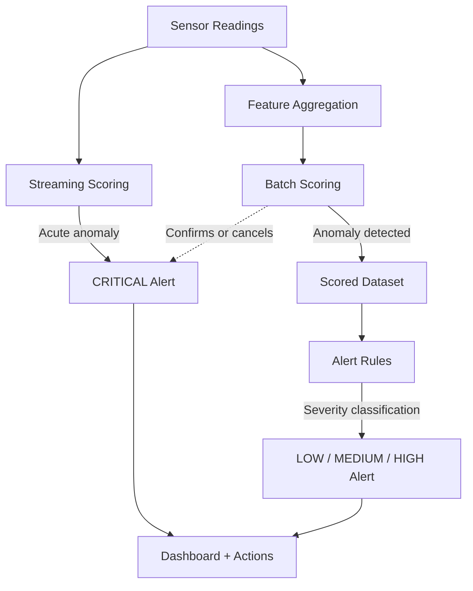

# ADR-002: Hybrid Batch + Streaming Scoring

## Status

Accepted

## Context

We run anomaly detection models across 100K+ refrigeration devices to provide 12–24 hours of lead time before equipment failure. The question is how to score these models:

1. **Pure batch**: score the entire fleet on a schedule (e.g., hourly or daily)
2. **Pure streaming**: score every sensor reading as it arrives in real-time
3. **Hybrid**: batch scoring for comprehensive analysis + streaming for urgent anomalies

The choice affects detection latency, compute cost, model complexity, and operational simplicity.

### Constraints

- The target lead time is 12–24 hours. Most failure patterns develop gradually — compressor vibration increases over hours, refrigerant pressure drops slowly, temperature drift is a multi-hour trend.
- Some failure modes are acute: sudden compressor current spike, rapid pressure loss. These need sub-minute detection.
- The fleet produces ~14M readings/min. Scoring complex models (Isolation Forest, Autoencoder) on every reading in real-time is computationally expensive and fragile.
- All processing must be Foundry-native ([ADR-001](./adr-001-foundry-native.md)). Foundry supports both batch transforms and streaming (Flink-based) transforms, but streaming transforms have more limited capabilities.

## Decision

Use a hybrid approach: **batch scoring as the primary detection mechanism**, supplemented by **streaming scoring for acute anomalies only**.

### Batch Scoring Path

- Runs on aggregated features from the [offline feature store](./data-contracts.md) (15-minute windows)
- Scheduled hourly for primary models, daily for fleet-wide cohort models
- Executes all model types: statistical, Isolation Forest, Autoencoder
- Produces the canonical `model_scores` dataset that feeds the alert pipeline
- Handles the full feature set (~45 features per device per window)

### Streaming Scoring Path

- Operates on raw or minimally aggregated sensor readings from the streaming dataset
- Evaluates lightweight rules and single-feature threshold models only:
  - Compressor current > absolute threshold (immediate overload risk)
  - Vibration exceeds 3× the device's 24-hour moving average (sudden mechanical event)
  - Pressure drop rate > threshold (acute refrigerant leak)
  - Temperature rise rate > threshold (complete cooling loss)
- Does **not** run complex ML models (no Isolation Forest, no Autoencoder in streaming)
- Produces alerts directly for `CRITICAL` severity events
- Uses Foundry streaming transforms (Flink-based) with pre-hydrated Ontology properties for device-specific thresholds

### How They Interact

The streaming path acts as a fast-but-coarse early warning. The batch path provides comprehensive, multi-model analysis. When the streaming path fires a `CRITICAL` alert, the next batch scoring run either confirms it (the anomaly persists with high score) or softens it (the anomaly was transient, score is low). This avoids the streaming path being a source of persistent false positives.

## Consequences

### Benefits

**Detection latency matches risk profile.** Gradual failures (the majority) are caught by hourly batch scoring — well within the 12–24 hour lead time. Acute failures (rare but dangerous) are caught in under 2 minutes by streaming. We don't pay the cost of real-time scoring for problems that develop over hours.

**Simpler ML models in production.** Batch scoring uses pre-aggregated features (15-minute windows), which are lower-dimensional, more stable, and easier to reason about than raw per-reading data. This means we can use standard anomaly detection algorithms without worrying about streaming windowing complexity or late-arriving data in the model input.

**Lower compute cost.** Scoring 100K devices × 1 feature row per window × once per hour is dramatically cheaper than scoring 14M readings per minute through an ML model. The streaming path runs only simple threshold checks, which are computationally trivial.

**Graceful degradation.** If batch scoring is delayed (Spark job queue, cluster issues), the streaming path still catches acute anomalies. If streaming is down, batch scoring still runs. Neither path is a single point of failure for the other.

**Feature richness for batch models.** Batch models can use the full feature set including cross-sensor ratios, frequency-domain features, and fleet-level statistics. These features are impossible to compute in a single-event streaming context — they require time windows and fleet aggregation.

### Costs and Risks

**Two scoring systems to maintain.** Batch and streaming transforms are different codebases with different testing patterns. Streaming Flink transforms in Foundry have different APIs than batch PySpark transforms. This increases the maintenance surface area.

Mitigation: keep the streaming path deliberately simple — threshold checks only, no ML model inference. The streaming codebase should be < 200 lines.

**Alert reconciliation complexity.** When both paths fire on the same device, we need reconciliation logic to avoid duplicate alerts. The batch path may confirm a streaming alert (upgrade to sustained anomaly) or contradict it (downgrade to transient spike).

Mitigation: clear [alert deduplication rules](./data-contracts.md) with a 4-hour suppression window and a `first_detected_at` timestamp that tracks across both paths.

**Threshold tuning for streaming.** The streaming path's threshold-based rules need per-device or per-cohort calibration. A compressor current threshold of 20A might be normal for a large unit and alarming for a small one. These thresholds must be maintained in the Ontology as device properties.

Mitigation: derive streaming thresholds from batch model training — the batch models' learned decision boundaries inform the streaming thresholds. Update thresholds when models are retrained.

**Missing gradual anomalies in the gap between batch runs.** If batch scoring runs hourly and a failure mode develops faster than expected, there's a gap. An anomaly that becomes critical 30 minutes after the last batch run won't be caught until the next run.

Mitigation: for known fast-developing failure modes (e.g., compressor seizure), add specific streaming rules. The streaming path is the safety net for the batch path's latency.

## Alternatives Considered

### Pure Batch (Hourly)

Simpler architecture — one scoring path, one codebase, one set of alerts. Rejected because:
- Acute failures (sudden compressor overload, rapid pressure loss) need sub-minute detection
- An hour of delay for a critical anomaly is unacceptable when the equipment could be damaged in minutes
- The 12–24 hour lead time target applies to gradual degradation, not acute events

### Pure Streaming (Score Every Reading)

Maximum detection speed — every reading scored immediately. Rejected because:
- Scoring 14M readings/min through an Isolation Forest or Autoencoder is computationally prohibitive on Foundry
- Complex anomaly detection models need windowed features (rolling means, cross-sensor ratios) that can't be computed on single readings
- Streaming transforms in Foundry (Flink) have limited library support for ML inference
- Operational complexity of maintaining stateful streaming ML models at this scale is high

### Lambda Architecture (Batch Rewrites Streaming Results)

Classic approach where streaming produces approximate results and batch rewrites them with exact ones. Rejected because:
- We don't need exact rewriting — the batch and streaming paths answer different questions (gradual vs. acute)
- Lambda's complexity (maintaining equivalent logic in two systems) is not justified when the streaming path is intentionally limited to threshold checks

## Cross-References

- [System Overview](./system-overview.md) — data flow showing both scoring paths
- [Data Contracts](./data-contracts.md) — `model_scores` and `device_alerts` schemas, alert deduplication rules
- [ADR-001: Foundry-Native](./adr-001-foundry-native.md) — why both paths run inside Foundry
- [ADR-003: Anomaly Detection First](./adr-003-anomaly-detection-first.md) — the models being scored in the batch path
