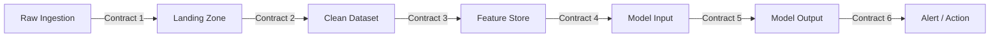

# Data Contracts

## Why Contracts Matter Here

With 100K+ devices, 14 sensors, and multiple pipeline stages, an implicit schema change in one transform can silently break everything downstream. These contracts are the agreement between pipeline stages — changing a column name, type, or SLA requires updating this doc and notifying all downstream consumers.

Every schema below maps to a Foundry dataset. Schema enforcement uses [Foundry dataset expectations](../03-production/data-quality.md). Column names use `snake_case` throughout.

## Pipeline Boundaries

---

## Contract 1: Raw Ingestion → Landing Zone

The landing zone stores events exactly as received from IoT Hub via Event Hubs. No transformation — only append. This is the system of record.

### Schema: `raw_sensor_readings`

| Column | Type | Nullable | Description |
|--------|------|----------|-------------|
| `event_id` | `string` | No | UUID assigned by IoT Hub. Deduplication key. |
| `device_id` | `string` | No | Unique device identifier from device registry. |
| `timestamp_device` | `timestamp` | No | Reading time as reported by the device (local clock). |
| `timestamp_ingested` | `timestamp` | No | Time the event was received by IoT Hub (server clock). Used for late-arrival detection. |
| `temperature_evaporator` | `double` | Yes | °C. Evaporator coil temperature. |
| `temperature_condenser` | `double` | Yes | °C. Condenser coil temperature. |
| `temperature_ambient` | `double` | Yes | °C. Ambient environment temperature. |
| `temperature_discharge` | `double` | Yes | °C. Compressor discharge line temperature. |
| `temperature_suction` | `double` | Yes | °C. Compressor suction line temperature. |
| `pressure_high_side` | `double` | Yes | kPa. High-side (discharge) refrigerant pressure. |
| `pressure_low_side` | `double` | Yes | kPa. Low-side (suction) refrigerant pressure. |
| `current_compressor` | `double` | Yes | Amps. Compressor motor current draw. |
| `vibration_compressor` | `double` | Yes | mm/s RMS. Compressor vibration level. |
| `humidity` | `double` | Yes | %RH. Relative humidity inside the unit. |
| `door_open_close` | `boolean` | Yes | true = door open, false = door closed. |
| `defrost_cycle` | `boolean` | Yes | true = defrost active, false = normal operation. |
| `superheat` | `double` | Yes | K (Kelvin delta). Difference between suction temp and evaporator saturation temp. |
| `subcooling` | `double` | Yes | K (Kelvin delta). Difference between condenser saturation temp and liquid line temp. |
| `_partition_key` | `string` | No | Event Hubs partition key (typically `device_id`). |
| `_sequence_number` | `long` | No | Event Hubs sequence number. Used for ordering within partition. |

### Sensor columns are nullable

Devices may not report all 14 sensors in every reading. Common reasons: sensor offline, firmware version doesn't support that sensor, intermittent connectivity drops mid-transmission. Downstream transforms must handle nulls explicitly — never assume a complete row.

### SLA

| Guarantee | Target |
|-----------|--------|
| Freshness | Events appear in landing zone within **5 minutes** of `timestamp_ingested`. Bounded by the streaming dataset's batch materialization interval. |
| Completeness | ≥ 99.5% of events from Event Hubs land successfully (measured daily) |
| Durability | Landing zone is append-only; no deletes or updates. Retained for **90 days** minimum. |
| Ordering | **Not guaranteed** across partitions. Guaranteed within a single partition (`_partition_key`). |

---

## Contract 2: Landing Zone → Clean Dataset

The cleansing transform validates, deduplicates, and normalizes raw data. This is where bad data gets flagged or removed.

### Schema: `clean_sensor_readings`

| Column | Type | Nullable | Description |
|--------|------|----------|-------------|
| `event_id` | `string` | No | From raw. Deduplicated — no duplicate `event_id` values exist in this dataset. |
| `device_id` | `string` | No | From raw. Validated against device registry. Unknown devices are routed to a quarantine dataset. |
| `timestamp_utc` | `timestamp` | No | Normalized to UTC. Derived from `timestamp_device` with timezone correction. If device clock is implausible (>24h drift from `timestamp_ingested`), `timestamp_ingested` is used instead. |
| `temperature_evaporator` | `double` | Yes | Range-validated: -60°C to +30°C. Out-of-range → null + quality flag. |
| `temperature_condenser` | `double` | Yes | Range-validated: +20°C to +80°C. |
| `temperature_ambient` | `double` | Yes | Range-validated: -40°C to +60°C. |
| `temperature_discharge` | `double` | Yes | Range-validated: +30°C to +150°C. |
| `temperature_suction` | `double` | Yes | Range-validated: -40°C to +30°C. |
| `pressure_high_side` | `double` | Yes | Range-validated: 500 to 3500 kPa. |
| `pressure_low_side` | `double` | Yes | Range-validated: 50 to 800 kPa. |
| `current_compressor` | `double` | Yes | Range-validated: 0 to 50 A. |
| `vibration_compressor` | `double` | Yes | Range-validated: 0 to 100 mm/s. |
| `humidity` | `double` | Yes | Range-validated: 0 to 100 %RH. |
| `door_open_close` | `boolean` | Yes | Unchanged from raw. |
| `defrost_cycle` | `boolean` | Yes | Unchanged from raw. |
| `superheat` | `double` | Yes | Range-validated: -5 to +50 K. Negative values are physically suspect but retained with quality flag. |
| `subcooling` | `double` | Yes | Range-validated: -5 to +30 K. |
| `quality_flags` | `array<string>` | No | List of quality issues detected. Empty array = clean row. Values: `RANGE_VIOLATION`, `CLOCK_DRIFT`, `DUPLICATE_REMOVED`, `SENSOR_GAP`, `DEVICE_UNKNOWN`. |
| `sensor_null_count` | `integer` | No | Number of sensor columns that are null (0–14). Used for downstream completeness filtering. |

### What Gets Removed

- **Exact duplicates**: same `event_id` → keep first by `_sequence_number`
- **Unknown devices**: `device_id` not in device registry → routed to `quarantine_sensor_readings` (separate dataset, same schema)
- **Corrupt rows**: all 14 sensor columns null → dropped entirely (logged to dead-letter)

### SLA

| Guarantee | Target |
|-----------|--------|
| Freshness | Within **15 minutes** of landing zone append |
| Completeness | ≥ 99.9% of valid landing zone rows appear in clean dataset |
| Quality | 0 rows violate range constraints without a corresponding `quality_flags` entry |
| Idempotency | Re-running the transform on the same input produces identical output |

---

## Contract 3: Clean Dataset → Feature Store (Offline)

Feature engineering transforms clean readings into time-windowed aggregations. Each row represents one device over one time window. See [Feature Engineering](../02-feature-engineering/) for computation details.

### Schema: `device_features`

| Column | Type | Nullable | Description |
|--------|------|----------|-------------|
| `device_id` | `string` | No | Device identifier. |
| `window_start` | `timestamp` | No | Start of the aggregation window (UTC). |
| `window_end` | `timestamp` | No | End of the aggregation window (UTC). |
| `window_duration_minutes` | `integer` | No | Window length. Standard: 15, 60, 1440 (15m, 1h, 1d). |
| `reading_count` | `integer` | No | Number of raw readings in this window. Expected: ~15 for 15-min window. Used to detect sensor dropout. |
| **Temperature features** | | | |
| `temp_evaporator_mean` | `double` | Yes | Mean evaporator temperature in window. |
| `temp_evaporator_std` | `double` | Yes | Standard deviation. High std → instability. |
| `temp_evaporator_min` | `double` | Yes | Minimum value in window. |
| `temp_evaporator_max` | `double` | Yes | Maximum value in window. |
| `temp_evaporator_slope` | `double` | Yes | Linear trend (°C/min) via least-squares fit. Rising slope → warming trend. |
| `temp_condenser_mean` | `double` | Yes | Mean condenser temperature. |
| `temp_condenser_std` | `double` | Yes | |
| `temp_condenser_min` | `double` | Yes | |
| `temp_condenser_max` | `double` | Yes | |
| `temp_condenser_slope` | `double` | Yes | |
| `temp_ambient_mean` | `double` | Yes | Mean ambient temperature. |
| `temp_ambient_std` | `double` | Yes | |
| `temp_discharge_mean` | `double` | Yes | Mean discharge temperature. |
| `temp_discharge_std` | `double` | Yes | |
| `temp_discharge_max` | `double` | Yes | Peak discharge temp — high values indicate compressor stress. |
| `temp_suction_mean` | `double` | Yes | Mean suction temperature. |
| `temp_suction_std` | `double` | Yes | |
| **Pressure features** | | | |
| `pressure_high_mean` | `double` | Yes | Mean high-side pressure. |
| `pressure_high_std` | `double` | Yes | |
| `pressure_high_max` | `double` | Yes | |
| `pressure_low_mean` | `double` | Yes | Mean low-side pressure. |
| `pressure_low_std` | `double` | Yes | |
| `pressure_low_min` | `double` | Yes | Low pressure dropping → possible refrigerant leak. |
| `pressure_ratio` | `double` | Yes | `pressure_high_mean / pressure_low_mean`. Key indicator of compressor efficiency. |
| **Compressor features** | | | |
| `current_compressor_mean` | `double` | Yes | Mean compressor current. |
| `current_compressor_std` | `double` | Yes | |
| `current_compressor_max` | `double` | Yes | Peak current — spikes indicate mechanical stress. |
| `vibration_compressor_mean` | `double` | Yes | Mean vibration level. |
| `vibration_compressor_std` | `double` | Yes | |
| `vibration_compressor_max` | `double` | Yes | Peak vibration — sustained highs indicate bearing wear. |
| `vibration_compressor_p95` | `double` | Yes | 95th percentile vibration. More robust than max to outlier spikes. |
| **Environment features** | | | |
| `humidity_mean` | `double` | Yes | Mean humidity. |
| `humidity_std` | `double` | Yes | |
| `door_open_fraction` | `double` | Yes | Fraction of readings where door was open (0.0–1.0). High values → excessive door openings. |
| `defrost_active_fraction` | `double` | Yes | Fraction of readings where defrost was active (0.0–1.0). |
| **Thermodynamic features** | | | |
| `superheat_mean` | `double` | Yes | Mean superheat. Low → risk of liquid slugging. High → poor efficiency. |
| `superheat_std` | `double` | Yes | |
| `subcooling_mean` | `double` | Yes | Mean subcooling. Low → possible refrigerant undercharge. |
| `subcooling_std` | `double` | Yes | |
| **Cross-sensor features** | | | |
| `temp_spread_evap_cond` | `double` | Yes | `temp_condenser_mean - temp_evaporator_mean`. Indicates system thermal load. |
| `temp_spread_discharge_suction` | `double` | Yes | `temp_discharge_mean - temp_suction_mean`. Compressor work indicator. |
| `current_per_temp_spread` | `double` | Yes | `current_compressor_mean / temp_spread_evap_cond`. Efficiency metric — rising values mean more energy per degree of cooling. |
| **Data quality features** | | | |
| `sensor_completeness` | `double` | No | Fraction of non-null sensor readings in window (0.0–1.0). |
| `quality_flag_count` | `integer` | No | Number of readings with non-empty `quality_flags` in window. |

### Feature Naming Convention

Pattern: `{sensor_short}_{aggregation}` where:
- Sensor short names: `temp_evaporator`, `temp_condenser`, `temp_ambient`, `temp_discharge`, `temp_suction`, `pressure_high`, `pressure_low`, `current_compressor`, `vibration_compressor`, `humidity`, `door_open`, `defrost`, `superheat`, `subcooling`
- Aggregations: `mean`, `std`, `min`, `max`, `slope`, `p95`, `fraction`

> **Note:** `defrost_active_fraction` uses the extended short name `defrost_active` (not just `defrost`) to distinguish from the boolean `defrost_cycle` sensor column.

### SLA

| Guarantee | Target |
|-----------|--------|
| Freshness | Within **30 minutes** of clean dataset update |
| Completeness | Features computed for ≥ 99% of active devices per window |
| Window alignment | All windows aligned to clock boundaries (e.g., 15-min windows start at :00, :15, :30, :45) |
| Null policy | Feature is null only when **all** underlying readings in the window are null for that sensor. Partial data → compute on available readings. |

---

## Contract 4: Feature Store → Model Input

Model input is a view over the feature store, scoped to the features each model actually needs. Different model types (statistical, tree-based, deep learning) may select different feature subsets, but they all read from the same underlying `device_features` dataset.

### Schema: `model_input`

| Column | Type | Nullable | Description |
|--------|------|----------|-------------|
| `device_id` | `string` | No | Device identifier. |
| `window_start` | `timestamp` | No | Window start (UTC). |
| `window_end` | `timestamp` | No | Window end (UTC). |
| `model_id` | `string` | No | Identifier for the model variant being scored (e.g., `isolation_forest_v2`, `autoencoder_v1`). |
| `granularity` | `string` | No | One of: `fleet`, `cohort`, `device`. See [ADR-003](./adr-003-anomaly-detection-first.md). |
| `feature_vector` | `array<double>` | No | Ordered feature values as consumed by the model. Feature order defined in model metadata. |
| `feature_names` | `array<string>` | No | Column names corresponding to each position in `feature_vector`. Enables traceability. |
| `sensor_completeness` | `double` | No | From feature store. Models may refuse to score if below threshold (e.g., < 0.5). |

### Feature Selection Rules

- **Statistical models** (z-score, DBSCAN): use `_mean` and `_std` features only (~20 features)
- **Tree-based models** (Isolation Forest): use all numeric features (~45 features)
- **Deep learning models** (Autoencoder): use all numeric features, normalized to [0,1] range

Feature selection is defined per model in model metadata, not hardcoded in the pipeline. This allows adding or removing features without changing the scoring transform.

### SLA

| Guarantee | Target |
|-----------|--------|
| Freshness | Same as feature store (within **30 minutes** of clean data) |
| Null handling | No nulls in `feature_vector` — nulls are imputed or the row is excluded before this stage |
| Feature consistency | `feature_names` matches the feature list the model was trained on. Mismatch → scoring fails loudly. |

---

## Contract 5: Model Output → Scored Dataset

Every model execution produces a scored dataset with uniform structure regardless of model type.

### Schema: `model_scores`

| Column | Type | Nullable | Description |
|--------|------|----------|-------------|
| `score_id` | `string` | No | UUID for this score record. |
| `device_id` | `string` | No | Device that was scored. |
| `window_start` | `timestamp` | No | Window start of the features used for scoring. |
| `window_end` | `timestamp` | No | Window end. |
| `model_id` | `string` | No | Which model produced this score. |
| `model_version` | `string` | No | Semantic version of the model artifact. |
| `granularity` | `string` | No | `fleet`, `cohort`, or `device`. |
| `anomaly_score` | `double` | No | Normalized to [0.0, 1.0]. 0 = normal, 1 = highly anomalous. Normalization method depends on model type. |
| `anomaly_flag` | `boolean` | No | `true` if `anomaly_score` exceeds the model's threshold. |
| `threshold_used` | `double` | No | The threshold applied for this scoring run. Stored for auditability. |
| `top_contributors` | `array<string>` | Yes | Feature names most responsible for the anomaly score (top 5). Null for models that don't support feature importance (e.g., some autoencoders). |
| `contributor_scores` | `array<double>` | Yes | Contribution magnitude for each feature in `top_contributors`. Same order. |
| `scored_at` | `timestamp` | No | When the scoring job ran (UTC). Distinct from `window_end` — there is a processing delay. |
| `sensor_completeness` | `double` | No | Carried forward from model input. Scores from low-completeness windows should be treated with lower confidence. |

### SLA

| Guarantee | Target |
|-----------|--------|
| Freshness (batch) | Scores available within **1 hour** of feature store update |
| Freshness (streaming) | Scores available within **2 minutes** of event ingestion |
| Coverage | ≥ 99% of active devices scored per batch run |
| Score determinism | Same model version + same input features → same score. No randomness in inference. |

---

## Contract 6: Model Output → Alert / Action

Alerts are derived from model scores. Not every anomaly flag becomes an alert — alert rules apply severity classification, deduplication, and suppression logic.

### Schema: `device_alerts`

| Column | Type | Nullable | Description |
|--------|------|----------|-------------|
| `alert_id` | `string` | No | UUID for this alert. |
| `device_id` | `string` | No | Affected device. |
| `site_id` | `string` | No | Site where the device is located. Derived from device registry join. Enables site-level alert aggregation. |
| `alert_type` | `string` | No | Category: `ANOMALY_DETECTED`, `ANOMALY_SUSTAINED`, `ANOMALY_ESCALATED`, `ANOMALY_RESOLVED`. |
| `severity` | `string` | No | `LOW`, `MEDIUM`, `HIGH`, `CRITICAL`. Derived from anomaly score and business rules. |
| `title` | `string` | No | Human-readable summary. E.g., "Compressor vibration anomaly detected on device X". |
| `description` | `string` | No | Details: which sensors are abnormal, trend direction, estimated time to action. |
| `model_id` | `string` | No | Model that triggered this alert. |
| `anomaly_score` | `double` | No | Score at alert creation time. |
| `top_contributors` | `array<string>` | Yes | Inherited from `model_scores`. |
| `first_detected_at` | `timestamp` | No | When the anomaly was first detected (may be earlier than this alert if sustained). |
| `alert_created_at` | `timestamp` | No | When this alert record was created. |
| `suppressed` | `boolean` | No | `true` if this alert was suppressed by deduplication rules (e.g., same device + same failure mode within 4 hours). |
| `ontology_action_id` | `string` | Yes | If an Ontology Action (e.g., work order creation) was triggered, its ID. Null if alert-only. |
| | | | **Workflow fields below are populated by Ontology Actions, not by the scoring pipeline.** |
| `status` | `string` | No | Alert lifecycle: `OPEN`, `ACKNOWLEDGED`, `IN_PROGRESS`, `RESOLVED`, `FALSE_POSITIVE`. Initial value: `OPEN`. |
| `resolved_at` | `timestamp` | Yes | When the alert was resolved. Null until resolved. |
| `escalation_level` | `string` | No | Escalation tier: `L1`, `L2`, `L3`. Initial value: `L1`. |
| `sla_deadline` | `timestamp` | No | Deadline for acknowledgment. Computed from severity: CRITICAL=30min, HIGH=2h, MEDIUM=4h, LOW=24h from `alert_created_at`. |
| `sla_breached` | `boolean` | No | Whether the SLA deadline passed without acknowledgment. Initial value: `false`. |

### Severity Rules

| Severity | Condition | Action |
|----------|-----------|--------|
| `LOW` | `anomaly_score` 0.6–0.7, or single model flags anomaly | Log to dashboard. No notification. |
| `MEDIUM` | `anomaly_score` 0.7–0.85, or 2+ models agree | Dashboard + email notification to site team. |
| `HIGH` | `anomaly_score` 0.85–0.95, sustained for 2+ consecutive windows | Dashboard + push notification + auto-create work order. |
| `CRITICAL` | `anomaly_score` > 0.95, or streaming path detects acute spike | Immediate push notification + escalation to on-call + auto-create urgent work order. |

### Alert Deduplication

Same `device_id` + same `model_id` + same dominant `top_contributors[0]` within a 4-hour window → suppressed. The first alert stays active; subsequent ones are created with `suppressed = true` for audit purposes.

### SLA

| Guarantee | Target |
|-----------|--------|
| Alert latency (batch) | Within **5 minutes** of scoring completion |
| Alert latency (streaming) | Within **1 minute** of scoring |
| False suppression rate | < 1% of genuine new failure modes suppressed by dedup rules |

---

## Schema Evolution Strategy

### Adding a New Sensor

1. Add nullable column to `raw_sensor_readings` — existing rows get null, no breakage
2. Add range validation to cleansing transform
3. Add feature columns to `device_features` — nullable, computed when data available
4. Retrain models with new features (or ignore nulls if feature selection excludes them)
5. Update this document

### Removing a Sensor

1. Stop populating the column in raw data (column remains, values become null)
2. Feature computation gracefully handles all-null windows (feature = null)
3. Models trained without the feature continue to work
4. After deprecation period (90 days), remove column from schema
5. Update this document

### Changing a Column Type

Never change a column type in-place. Instead:
1. Add new column with the target type (e.g., `pressure_high_side_v2`)
2. Populate both old and new columns during migration period
3. Migrate downstream consumers to new column
4. Deprecate old column
5. Update this document

### Enforcing Contracts

All contracts are enforced via Foundry dataset expectations. Expectations run as part of the transform and will fail the build if violated. See [Data Quality & Monitoring](../03-production/data-quality.md) for expectation patterns.

## Cross-References

- [System Overview](./system-overview.md) — visual data flow showing where each contract applies
- [ADR-001: Foundry-Native](./adr-001-foundry-native.md) — why contracts are enforced via Foundry expectations
- [Feature Engineering](../02-feature-engineering/) — implementation of Contract 3 transformations
- [Data Quality & Monitoring](../03-production/data-quality.md) — expectation enforcement details
