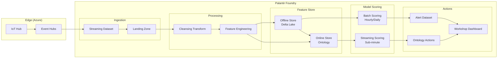

# System Overview

## Why This Architecture Exists

We need to detect refrigeration equipment failures 12–24 hours before they happen, across a fleet of 100K+ devices, each producing 14 sensor readings per minute. That's ~14 million readings per minute at steady state. The system must handle this volume while keeping anomaly detection results fresh enough to act on — meaning hourly batch scoring for routine monitoring and sub-minute streaming for urgent anomalies.

Every component runs inside Palantir Foundry. See [ADR-001](./adr-001-foundry-native.md) for why.

## End-to-End Data Flow

## Component Responsibilities

### Ingestion Layer

| Component | Responsibility | Failure Mode |
|-----------|---------------|--------------|
| **Azure IoT Hub** | Device authentication, message routing, cloud gateway | Hub outage → messages queue on device (limited buffer). If buffer overflows, readings are lost. |
| **Event Hubs** | Durable message buffer between Azure and Foundry | Partition-level failures → rebalance consumers. Retention window (default 7 days) bounds replay capability. |
| **Streaming Dataset** | Foundry's real-time ingestion endpoint. Receives events from Event Hubs connector. | Connector failure → Foundry auto-retries. Schema mismatch → events land in dead-letter dataset. |
| **Landing Zone** | Raw, append-only dataset in Foundry. Stores events as-received with ingestion metadata. | This is the system of record for raw data. Corruption here means data loss. |

The ingestion path is intentionally simple: no transformation happens before the landing zone. Raw data hits durable storage first, processed second. See [Ingestion Architecture](../01-ingestion/architecture.md) for details.

### Processing Layer

| Component | Responsibility | Failure Mode |
|-----------|---------------|--------------|
| **Cleansing Transform** | Null handling, range validation, duplicate removal, timezone normalization | Bad rules → silent data corruption. Mitigated by [dataset expectations](../03-production/data-quality.md). |
| **Feature Engineering** | Rolling aggregations, cross-sensor ratios, frequency-domain features, fleet-level statistics | Incorrect window logic → feature skew. Mitigated by [point-in-time tests](../03-production/testing.md). |

Both transforms run as Foundry Transforms (`@transform_df` / `@transform`) — incremental where possible. Full recomputation happens only on schema changes or backfills. See [Feature Engineering](../02-feature-engineering/) for implementation patterns.

### Feature Store

| Component | Responsibility | Failure Mode |
|-----------|---------------|--------------|
| **Offline Store (Delta Lake)** | Versioned, columnar feature tables for batch scoring and training. Point-in-time correct. | Stale features → model scores on old data. Monitored via pipeline SLAs and [data freshness checks](../03-production/data-quality.md). |
| **Online Store (Ontology)** | Pre-hydrated scalar properties for real-time lookups during streaming scoring. The Ontology also serves raw sensor history via Time Series properties for device deep-dive (see [Ontology Design](../04-palantir/ontology-design.md)). | Ontology sync lag → streaming model sees stale features. Bounded by Ontology sync frequency (typically <5 min). |

The offline store is the source of truth. The online store is a materialized view derived from it. See [Feature Store Patterns](../02-feature-engineering/feature-store.md) for the sync mechanism.

### Model Scoring

| Component | Responsibility | Failure Mode |
|-----------|---------------|--------------|
| **Batch Scoring** | Runs anomaly detection models hourly (critical) or daily (routine) across the full fleet. Produces scored datasets with anomaly flags and confidence. | Late scoring run → stale anomaly flags. Alerts not generated until next successful run. |
| **Streaming Scoring** | Evaluates lightweight anomaly rules on real-time sensor data. Catches urgent deviations that can't wait for batch. | Model too complex for streaming latency → degraded to threshold-based fallback. |

See [ADR-002](./adr-002-batch-plus-streaming.md) for detailed rationale on the hybrid approach.

### Action Layer

| Component | Responsibility | Failure Mode |
|-----------|--|--------------|
| **Alert Dataset** | Persisted anomaly scores and alerts. Serves as audit trail and input for downstream dashboards. | No failure mode beyond storage — append-only. |
| **Ontology Actions** | Trigger work orders, escalations, or automated responses based on anomaly severity. Operates within a **Site** hierarchy — alerts are aggregated by site for regional operations teams. See [Ontology Design](../04-palantir/ontology-design.md) for the Site object type and site-level aggregation patterns. | Action execution failure → retry queue. If retries exhausted, falls back to alert-only (human must act). |
| **Workshop Dashboard** | Operational visibility: fleet health, anomaly trends, device drill-down. | Dashboard is read-only — failure here doesn't affect detection or alerting. |

## Latency Budget

The 12–24 hour lead time for failure prediction gives us a generous latency budget for batch scoring. Streaming scoring targets sub-minute latency for acute anomalies (e.g., sudden compressor current spike).

| Stage | Target Latency | Rationale |
|-------|---------------|-----------|
| IoT Hub → Event Hubs | < 1 second | Azure-managed, minimal processing |
| Event Hubs → Streaming Dataset | < 30 seconds | Foundry connector polling interval |
| Streaming Dataset → Landing Zone | < 1 minute | Append-only, no transform |
| Landing Zone → Clean Dataset | < 15 minutes | Incremental transform, runs continuously or on short schedule |
| Clean Dataset → Feature Store (Offline) | < 30 minutes | Incremental feature computation, windowed aggregations |
| Feature Store → Batch Scoring | < 1 hour | Scheduled hourly for critical models, daily for routine |
| End-to-end (batch path) | < 2 hours | Well within 12–24 hour lead time |
| End-to-end (streaming path) | < 2 minutes | For urgent anomalies only (threshold + lightweight model) |

These are targets, not SLAs. Actual latency depends on Foundry cluster load and Spark job queuing. See [Data Contracts](./data-contracts.md) for formal freshness guarantees.

## Data Volume Estimates

| Metric | Value |
|--------|-------|
| Devices | 100,000+ |
| Sensors per device | 14 |
| Reading frequency | ~1/min per sensor |
| Readings per minute (fleet) | ~1.4 million |
| Readings per hour (fleet) | ~84 million |
| Readings per day (fleet) | ~144 million (wide-format: 100K devices × 1440 min/day) |
| Estimated raw row size | ~200 bytes |
| Raw data per day | ~30 GB (Parquet). ~100 GB/day raw JSON before columnar compression. |
| Raw data per month | ~0.9 TB (Parquet). ~3 TB raw JSON. |
| Feature store rows per day | ~12 million (all window sizes: 9.6M at 15-min + 2.4M at 1-hour + 100K at 1-day) |

These volumes drive the decision to use incremental transforms everywhere and to keep the streaming path lightweight. Full-fleet recomputation is expensive and reserved for backfills.

## Cross-References

- [Data Contracts](./data-contracts.md) — concrete schemas at each boundary shown above
- [ADR-001: Foundry-Native](./adr-001-foundry-native.md) — why everything runs inside Foundry
- [ADR-002: Batch + Streaming](./adr-002-batch-plus-streaming.md) — why the dual scoring paths
- [ADR-003: Anomaly Detection First](./adr-003-anomaly-detection-first.md) — why unsupervised models are the starting point
- [Foundry Platform Reference](../04-palantir/foundry-platform-reference.md) — Foundry primitives used throughout
